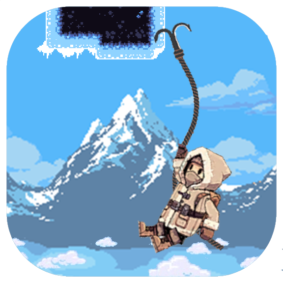
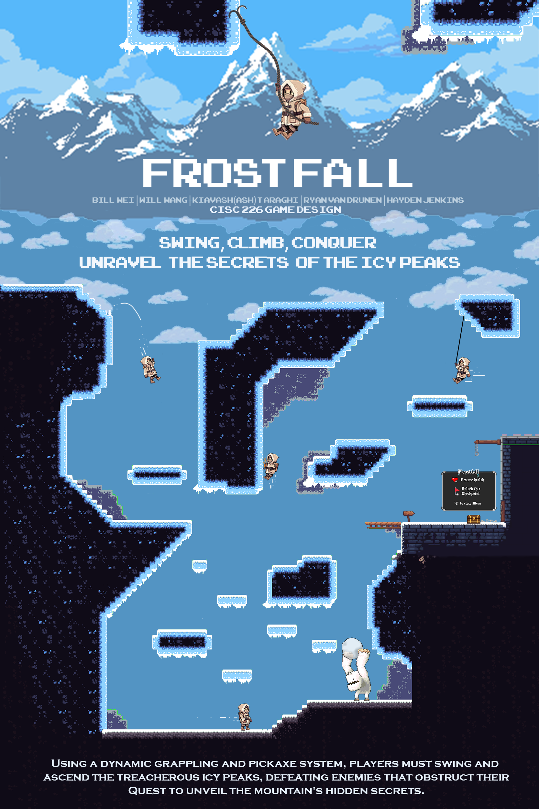

# ReadMe

 

  

  <h3 align="center">Frost Fall</h3>

  
Swing, Climb, Conquer, Unravel the Secrets of the Icy Peaks

  
 CISC-226 Game Development Project

  

    <a href="https://hjenkins2004.itch.io/frostfall2d">Play The Game</a>
    <a href="./Documentation/Final-Video-Demo.mp4">View Demo Preview</a>
  

# CISC226 Game Development Project

"Frostfall" is a 2D vertical platformer where players control a rugged mountaineer navigating a challenging, winter mountain and castle setting using a grappling gun and pickaxe as tools. Players must also engage in combat with enemies being rewarded for precision and timing of attacks, enhancing the overall strategic gameplay. The main goal is to reach the end of the map by defeating bosses and overcoming obstacles. “Frostfall” targets players aged 10-30, offering a progressively challenging experience while remaining accessible to players of varying skill levels.

## Table Of Contents
- [Poster](#poster)
- [Features](#features)
- [Contents](#contents)
- [Acknowledgements](#acknowledgements)

## Poster
 

  

## Features
- Winter Mountain Environment
- Tutorial Level
- Grappling Mechanic
- Pickaxe Mechanic
- Checkpoints
- Enemy combat
- Monetary system

## Contents
- [Inital Propsal](./Documentation/Proposal.pdf)
- [Controls](./Documentation/Controls.pdf)

## Acknowledgements
- **Bill Wei** - [GitHub profile](https://github.com/icsbillwei)
- **Will Wang** - [GitHub profile](https://github.com/WillW0426)
- **Kiavash (Ash) Taraghi** - [GitHub profile](https://github.com/Ash-Taraghi)
- **Ryan Van Drunen** - [GitHub profile](https://github.com/ryanvandrunen)
- [Media List](./Documentation/Media-List.pdf)
